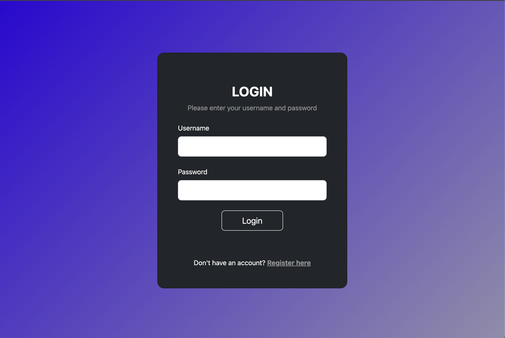
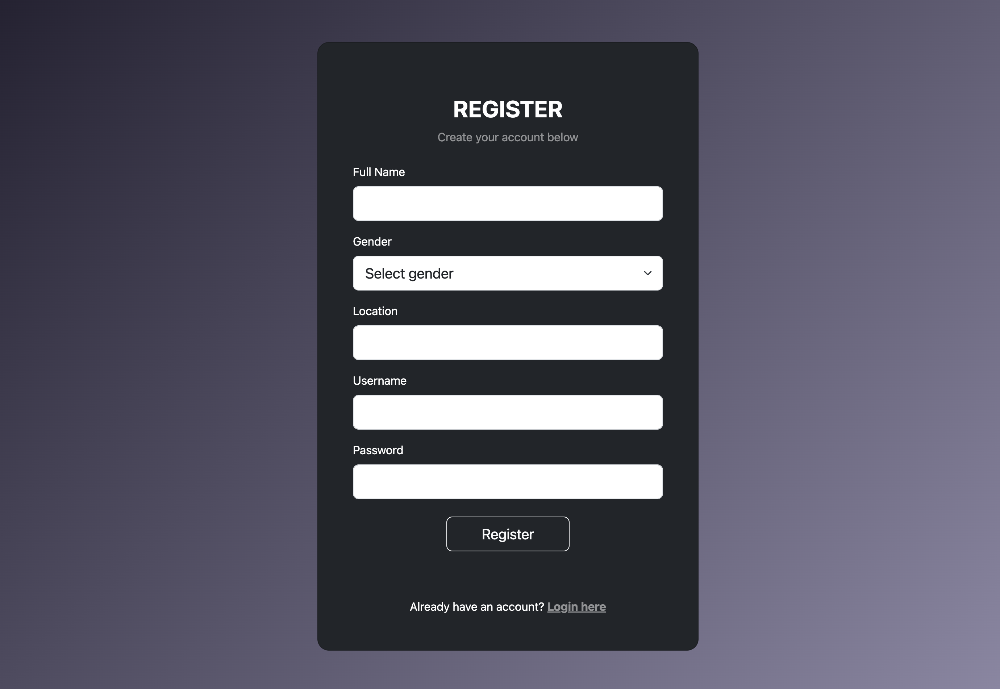
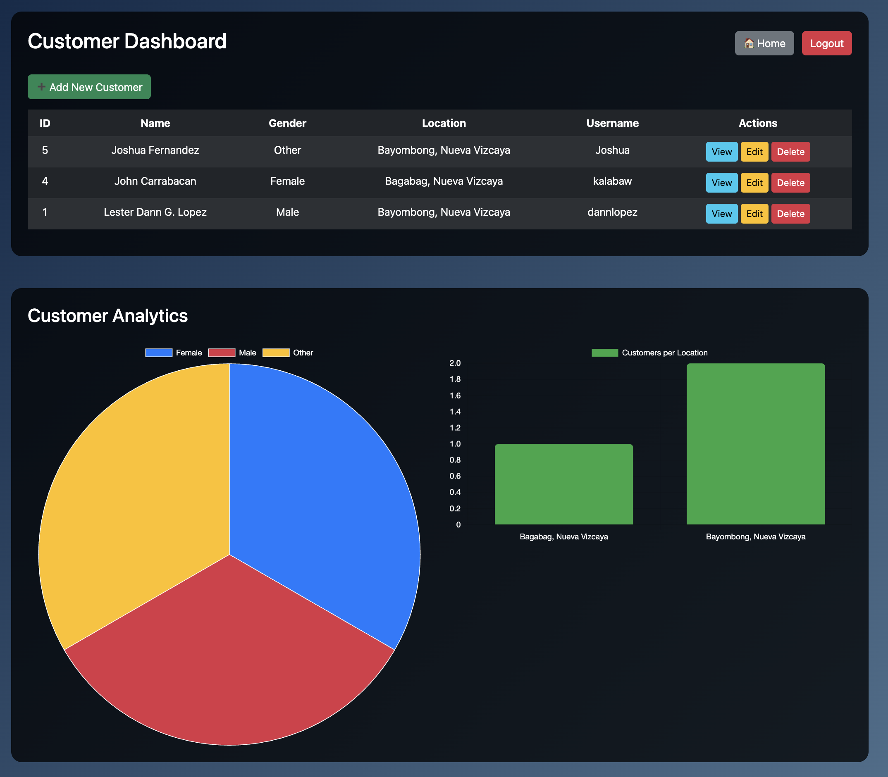

# Lester Dann Lopez — PHP/MySQL Customer Management System

This is a student web application project developed for the Information Management subject. It demonstrates a complete login, registration, and customer data management system using PHP, MySQL, Bootstrap, and Chart.js.

## 📌 Features

* User registration with name, gender, location, username, and password (hashed)
* Login system using the customers table
* Session-based access control (only logged-in users can access dashboard)
* Bootstrap-styled dashboard that displays all customers
* View, Edit, and Delete functions for each customer
* Add new customers via registration form
* Analytics section showing:

  * Pie chart of gender distribution
  * Bar chart of customer count per location
* Secure logout
* Responsive front-end UI with dark and gradient styling

## 🛠 Technologies Used

* PHP 8.x
* MySQL (via XAMPP on macOS)
* HTML5, CSS3
* Bootstrap 5.3
* Chart.js (for graphs)
* Visual Studio Code (VS Code)
* DBeaver for database management

## 🧪 How to Run the Project

1. Start XAMPP and make sure Apache and MySQL are running.
2. Place the lester\_site folder inside:
   /Applications/XAMPP/htdocs/
3. Open your browser and go to:
   [http://localhost/lester\_site/](http://localhost/lester_site/)
4. Create the database:

   * Open phpMyAdmin or DBeaver
   * Run the SQL script inside /query/create\_database.sql
     (It will create the user\_system database and customers table with one sample entry)
5. Make sure your config.php contains:

   ```php
   $host = 'localhost';
   $dbname = 'user_system';
   $username = 'root';
   $password = ''; // or your MySQL root password
   ```
6. Register a new customer or log in using:

   * Username: juan123
   * Password: 1234

## 📸 Screenshots

Include images of:

* Login form

* Register form

* Customer dashboard | Analytics charts (gender & location)


## 🧑‍🎓 Author

Lester Dann Lopez
Information Management — Student Project
May 2025